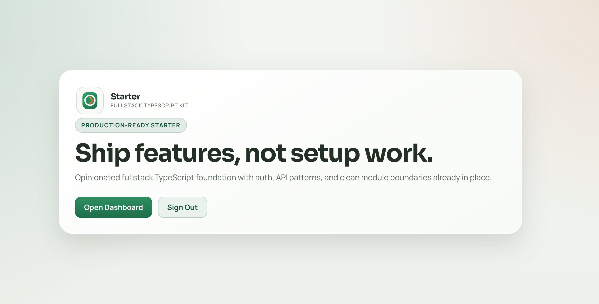

# TypeScript Fullstack Starter

A bulletproof, fully type-safe Express + Prisma API with a React + Vite + TypeScript frontend.



## Stack

| Layer      | Choice                    | Why                                  |
| ---------- | ------------------------- | ------------------------------------ |
| Runtime    | Node.js + TypeScript      | Full type safety end-to-end          |
| Framework  | Express                   | Minimal, modular, battle-tested      |
| ORM        | Prisma                    | Type-safe queries, migrations        |
| Auth       | JWT + Passport Google     | Stateless + social login             |
| Validation | Zod                       | Schema = types (no duplication)      |
| DB         | PostgreSQL                | Solid default for most apps          |
| Frontend   | React + Vite + TypeScript | Fast HMR, type-safe UI               |
| Routing    | React Router v7           | File-based routing, protected routes |

## Project structure

```
starter/
├── src/                  # Express API
│   ├── config/           # Env vars — validated at startup with Zod
│   ├── lib/
│   │   ├── prisma.ts     # Singleton PrismaClient
│   │   └── errors.ts     # Typed error classes
│   ├── middleware/
│   │   ├── errorHandler.ts   # Global error → JSON
│   │   ├── requireAuth.ts    # JWT guard + RBAC helper
│   │   └── validate.ts       # Zod body/query/params validation
│   ├── modules/
│   │   ├── auth/         # register, login, refresh, logout, Google OAuth
│   │   ├── users/        # CRUD with role-based access
│   │   └── health/       # liveness + readiness probes
│   ├── types/            # Shared interfaces, ApiResponse, AppModule
│   ├── app.ts            # Express factory
│   └── index.ts          # Entry point + graceful shutdown
├── client/               # React + Vite + TypeScript frontend
│   ├── src/
│   │   ├── context/
│   │   │   └── AuthContext.tsx     # JWT / user state + logout
│   │   ├── components/
│   │   │   └── ProtectedRoute.tsx  # Redirects to /login if not authenticated
│   │   ├── routes/
│   │   │   ├── public/             # Landing, Login, Register
│   │   │   └── protected/          # Dashboard (requires auth)
│   │   ├── App.tsx                 # Router setup
│   │   └── main.tsx
│   ├── index.html
│   ├── vite.config.ts              # /api proxy → Express :3000
│   └── package.json
├── prisma/
│   └── schema.prisma     # User, OAuthAccount, RefreshToken, Role
└── package.json          # Root scripts (dev, dev:client, dev:all)
```

## Quick start

```bash
# 1. Install workspace dependencies (server + client + shared)
npm install

# 2. Copy and fill env
cp .env.example .env

# 3. Start Postgres and pgAdmin
docker compose up -d

# 4. Run migrations and generate Prisma client
npm run db:migrate
npm run db:generate
```

### pgAdmin

pgAdmin is included in the Docker Compose setup for convenient database management.

| Detail   | Value                                          |
| -------- | ---------------------------------------------- |
| URL      | <http://localhost:5050>                        |
| Email    | `PGADMIN_DEFAULT_EMAIL` from your `.env` file  |
| Password | `PGADMIN_DEFAULT_PASSWORD` from your `.env` file |

> **Tip:** The default values in `.env.example` are `admin@admin.com` / `admin`. Update your `.env` file before running in any shared environment.

**Connecting to the Postgres server from pgAdmin:**

1. Open <http://localhost:5050> in your browser and log in.
2. Right-click **Servers → Register → Server…**
3. Fill in the **General** tab:
   - **Name**: `starter` (or any name you prefer)
4. Fill in the **Connection** tab:
   - **Host name/address**: `postgres` (the Docker service name)
   - **Port**: `5432`
   - **Maintenance database**: `mydb` (or the value you set in `DATABASE_URL`)
   - **Username**: `user` (or the value you set in `DATABASE_URL`)
   - **Password**: `password` (or the value you set in `DATABASE_URL`)
5. Click **Save**.

### Running the servers

**Option A — run both together** (requires `concurrently`, already in devDependencies):

```bash
npm run dev:all
```

**Option B — run separately** (two terminal windows):

```bash
# Terminal 1 — Express API on http://localhost:3000
npm run dev

# Terminal 2 — Vite dev server on http://localhost:5173
npm run dev:client
```

> The Vite dev server proxies all `/api` requests to `http://localhost:3000`, so the
> frontend and backend can be developed together without CORS issues.

## Frontend routes

| Path         | Type      | Description                                                    |
| ------------ | --------- | -------------------------------------------------------------- |
| `/`          | Public    | Landing page                                                   |
| `/login`     | Public    | Login form — calls `POST /api/v1/auth/login`                   |
| `/register`  | Public    | Registration form — calls `POST /api/v1/auth/register`         |
| `/dashboard` | Protected | Requires valid JWT; redirects to `/login` if not authenticated |

## API endpoints

```
POST   /api/v1/auth/register       Register with email + password
POST   /api/v1/auth/login          Login → { accessToken, refreshToken }
POST   /api/v1/auth/refresh        Rotate refresh token
POST   /api/v1/auth/logout         Revoke refresh token
GET    /api/v1/auth/me             Current user (JWT required)
GET    /api/v1/auth/google         Redirect to Google OAuth
GET    /api/v1/auth/google/callback  OAuth callback

GET    /api/v1/users               List users (ADMIN only)
GET    /api/v1/users/:id           Get user by id
PATCH  /api/v1/users/:id           Update own profile (or any if ADMIN)
DELETE /api/v1/users/:id           Delete own account (or any if ADMIN)

GET    /api/v1/health              Liveness probe
GET    /api/v1/health/ready        Readiness probe (pings DB)
```

## Authentication flow

```
Client                    API                       Google
  |                        |                           |
  |-- POST /auth/login --> |                           |
  |<-- { accessToken,      |                           |
  |      refreshToken } -- |                           |
  |                        |                           |
  |-- GET /auth/google --> |                           |
  |                        |--- redirect ------------> |
  |<------- redirect back to /google/callback -------- |
  |                        |<-- profile ---------------|
  |<-- redirect with tokens|                           |
```

Tokens:

- **Access token** — short-lived (15 min), sent as `Authorization: Bearer <token>`
- **Refresh token** — long-lived (7 days), stored in DB, rotated on every use

## Adding a new module

1. Create `src/modules/myfeature/`
2. Add `myfeature.service.ts`, `myfeature.schemas.ts`, `myfeature.router.ts`
3. Export an `AppModule` from the router file
4. Register it in `src/app.ts` MODULES array — done

Each module is fully self-contained and can be extracted to a standalone microservice by pointing it at its own DB + spinning up its own Express instance.

## Converting to microservices

Each module is designed to be extracted:

1. Copy the module folder to a new repo
2. Copy `lib/`, `middleware/`, `types/`, `config/` (shared kernel — consider a private npm package)
3. Wire up its own `app.ts` and `index.ts`
4. Replace direct service imports with HTTP or message-queue calls
